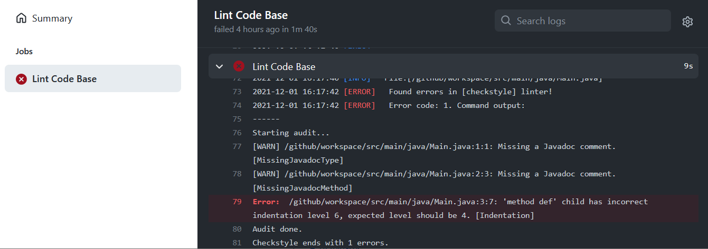

1. Erstelle ein neues lokales Repository. Sollte Dein erster Branch nicht `main` heißen, [benenne ihn in `main` um](https://stackoverflow.com/questions/6591213/how-do-i-rename-a-local-git-branch).
1. Erstelle ein leeres `README.md` und committe es.
1. Erstelle einen neuen Branch `superlinter` und checke ihn aus. (`git checkout -b superlinter`)
1. Erstelle im Wurzelverzeichnis des Repos eine `sun_checks.xml` Datei.
1. Füge den Inhalt dieses Gists in die `sun_checks.xml` Datei ein: <https://gist.github.com/jo3rn/3c9815d464a26dc0c0c55964cb89b2cf>

## Warum?

Mit der Datei `sun_checks.xml` wird konfiguriert, welche [Code Style Checks](https://checkstyle.sourceforge.io/checks.html) das Programm _Checkstyle_ ausführen soll. _Checkstyle_ überprüft alle Java-Dateien und verweist auf nicht eingehaltene Konventionen. Beispiel: der folgende Ausschnitt aus `sun_checks.xml` besagt, dass eine Einrückung (`Indentation`), z.B. nach einer sich öffnenden geschweiften Klammer, aus 2 Leerzeichen (`value="2"`) bestehen soll:

```xml
<module name="Indentation">
  <property name="basicOffset" value="2"/>
  ...
</module>
```

Für manche IDEs gibt es Plugins, damit _Checkstyle_ schon beim Programmieren auf Style-Probleme hinweist und/oder die Style-Probleme auf Knopfdruck korrigiert. Für IntelliJ IDEA gibt es z.B. das Plugin [CheckStyle-IDEA](https://plugins.jetbrains.com/plugin/1065-checkstyle-idea), welches man so konfigurieren kann, dass es unsere `sun_checks.xml` Regeln verwendet.

Man kann aber auch auf GitHub hochgeladene Java-Dateien automatisiert via _Checkstyle_ überprüfen lassen. Dazu müssen wir zunächst folgende Schritte ausführen:

1. Erstelle im Wurzelverzeichnis des Repos einen Pfad `.github/workflows` und dort eine `linter.yml` Datei.
1. Füge den Inhalt dieses Gists in die `linter.yml` Datei ein: <https://gist.github.com/jo3rn/10ed5a87f394096a2f55d5d0c092c7fb>
1. Committe den bisherigen Stand.

## Was passiert nun?

Wenn GitHub die Datei `linter.yml` im Verzeichnis `.github/workflows` vorfindet, versucht GitHub eine _Action_ anhand der in `linter.yml` spezifizierten Anweisungen zu starten. In `linter.yml` steht, dass bei jedem Push auf einen beliebigen Branch und bei jedem Pull Request auf den main Branch eine _Action_ ausgeführt werden soll. Welche Action das genau ist, steht weiter unten in der Datei und zwar soll `github/super-linter@v4` ([Super-Linter](https://github.com/github/super-linter)) ausgeführt werden. Es soll also der Code auf Style-Richtlinien überprüft werden. In `linter.yml` wird das eingeschränkt auf Java-Dateien und es sollen die Regeln aus der Datei `sun_checks.xml` im Wurzelverzeichnis angewandt werden.

Aber Moment! Aktuell haben wir ja nur ein lokales Repository. Jetzt wird es Zeit, GitHub ins Spiel zu bringen.

1. Erstelle ein neues leeres Repository auf GitHub (ohne initial commit, ohne `README.md`).
1. Verknüpfe Dein lokales Repo mit dem eben erstellten remote Repo. (`git remote add origin remote-url`)
1. Pushe alle Deine Branches zu GitHub. (`git push -u --all`)

In Deinem GitHub Repo hast du nun zwei Branches (`main` und `superlinter`). Auf `superlinter` ist auch schon der Linter konfiguriert. Was noch fehlt, ist eine Java-Datei zum Überprüfen.

1. Schreibe ein HelloWorld Programm in eine `HelloWorld.java` Datei.
1. Committe und pushe die Datei.
1. Gehe auf der Weboberfläche Deines GitHub-Repos auf den Reiter "Actions".

## Fast am Ziel!

Der Push auf den `superlinter` Branch triggert die Ausführung des Linters. Wenn bis hierhin alles nach Plan lief, solltest Du nach kurzer Zeit etwas Ähnliches sehen wie dies:


Das rote Kreuz links neben "Add linter workflow" zeigt an, dass der Linter nicht zufrieden ist. Ein grüner Haken hingegen würde anzeigen, dass der Linter nichts zu meckern hat. Hier wurde also irgendeine Style-Konvention missachtet. Bei einem Klick auf den Workflow und auf "Lint Code Base" werden weitere Details dazu angezeigt:



Aha! Die Ausgabe `child has incorrect indentation level 6, expected level should be 4` signalisiert, dass in Zeile 3 der `Main.java` Datei zu weit eingerückt wurde. Also schleunigst diese Einrückung gerade rücken (pun intended), sowie die Änderung committen und pushen. Im nächsten Durchlauf ist der Linter zufrieden:


Damit Euer Code stets sauber bleibt, solltet Ihr darauf achten, den Linter nie lange rot zu lassen.

Erstelle nun einen Pull Request vom `superlinter` Branch auf den `main` Branch. In der Pull Request Übersicht siehst Du, dass dabei auch der Linter startet. So können alle Beteiligten auf einen Blick sehen, ob sich die durch den Pull Request entstehenden Änderungen weiterhin an den festgelegten Code Style halten.

## Den Linter ausprobieren

Um Dir ganz sicher zu sein, dass der Linter funktioniert, solltest Du `HelloWorld.java` zunächst so schreiben, dass der Linter grün wird.

```Java
public class HelloWorld {
  public static void main(String[] args) {
    System.out.println("Hello World!");
  }
}
```

Versuche jetzt den Linter gezielt herauszufordern, indem Du eine Regel aus `sun_checks.xml` brichst. Committe und pushe den Regelbruch zu GitHub und sieh Dir die Linter-Ausgabe an. Mögliche Regelbrüche sind z.B.:

- mehr als 100 Zeichen in einer Zeile ([LineLength](https://checkstyle.sourceforge.io/config_sizes.html#LineLength))
- zu viel/wenig einrücken ([Indentation](https://checkstyle.sourceforge.io/config_misc.html#Indentation))
- sich öffnende geschweifte Klammer `{` in einer neuen Zeile ([LeftCurly](https://checkstyle.sourceforge.io/config_blocks.html#LeftCurly))
- Methoden-Name nicht smallCamelCase ([MethodName](https://checkstyle.sourceforge.io/config_naming.html#MethodName))
- inspiziere `sun_checks.xml` nach weiteren Regeln
